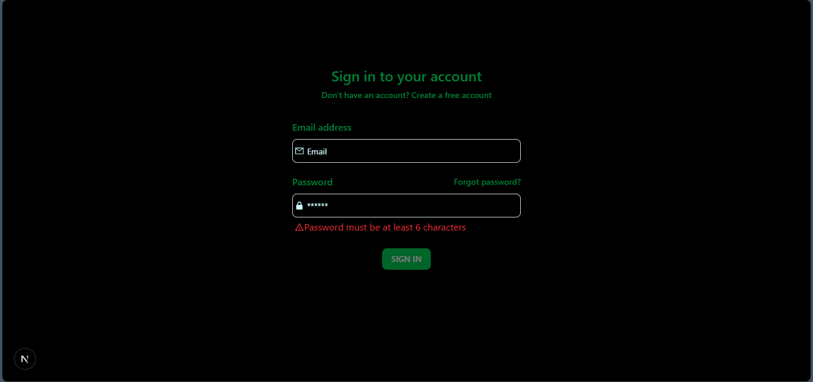
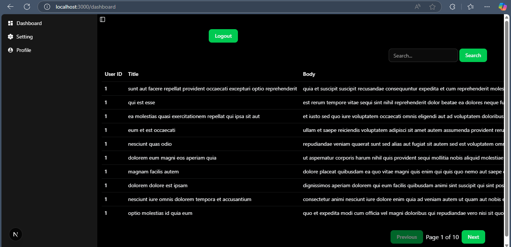
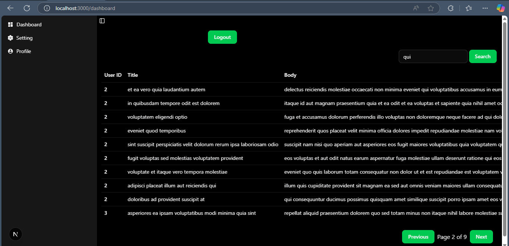

# Dynamic Dashboard

## Setup Instructions

1. **Clone the Repository**  
    ```bash
    git clone https://github.com/Ritu-03Thakur/dynamic-dashboard.git
    cd dynamic-dashboard
    ```

2. **Install Dependencies**  
    Ensure you have [Node.js](https://nodejs.org/) installed. Then run:
    ```bash
    npm install
    ```

3. **Start the Development Server**  
    ```bash
    npm run dev
    ```

    The application will be available at `http://localhost:3000`.

    ## Live Demo

    You can access the deployed version of the application [here](https://dynamic-dashboard-orpin.vercel.app/).

    ## Screenshots

     

    ### Dashboard Overview
    
    

    